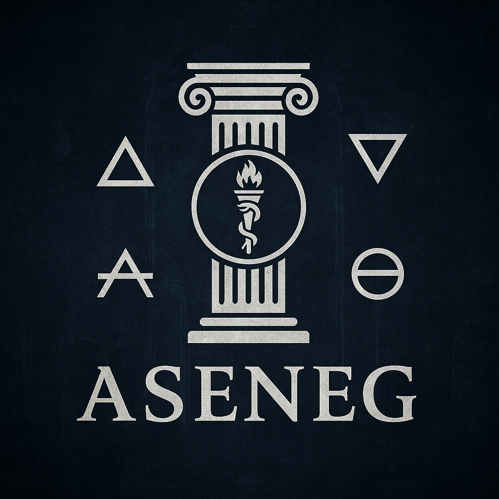

# ASENEG: Adaptive Symbolic Execution & Neural Exploit Generation 
##### (Defense Edition)

<p align="center">
  

<p align="center">
  
  
  
</p>

<p align="center">
  <a href="https://img.shields.io/badge/version-v10-blue?style=flat-square">
    
  </a>
  <a href="https://img.shields.io/badge/status-Defense--only%20Research-orange?style=flat-square">
    
  </a>
  <a href="https://img.shields.io/badge/license-Apache--2.0-green?style=flat-square">
    
  </a>
  <a href="https://img.shields.io/badge/arch-x86__64%20%7C%20x86__32%20%7C%20ARM%20%7C%20ARM64-informational?style=flat-square">
    
  </a>
  <a href="https://img.shields.io/badge/onnx-CodeBERT-critical?style=flat-square">
    
  </a>
</p>

> **Some guy on Discord:** *See deeper, act safer — program analysis with neural assistance, built for MF's.*

---

## Table of Contents

- [ASENEG: Adaptive Symbolic Execution \& Neural Exploit Generation](#aseneg-adaptive-symbolic-execution--neural-exploit-generation)
      - [(Defense Edition)](#defense-edition)
  - [Table of Contents](#table-of-contents)
  - [Overview](#overview)
  - [What ASENEG (Defense Edition) is not](#what-aseneg-defense-edition-is-not)
  - [Feature Highlights](#feature-highlights)
  - [Architecture Support](#architecture-support)
  - [Outputs](#outputs)
  - [Installation](#installation)
    - [Linux (Debian/Ubuntu)](#linux-debianubuntu)
    - [macOS (Homebrew)](#macos-homebrew)
    - [Windows (vcpkg / MSYS2)](#windows-vcpkg--msys2)
  - [Build](#build)
    - [Linux](#linux)
    - [macOS](#macos)
    - [Windows (MSVC + vcpkg)](#windows-msvc--vcpkg)
  - [Usage](#usage)
    - [Minimal](#minimal)
    - [Strict RCE mode](#strict-rce-mode)
    - [Disable CFG export](#disable-cfg-export)
    - [Help](#help)
  - [Commands \& Flags](#commands--flags)
  - [Model \& Tokenizer](#model--tokenizer)
  - [How vulnerabilities are scored](#how-vulnerabilities-are-scored)
  - [Roadmap / Future Work](#roadmap--future-work)
    - [Mitigation Awareness \& Bypass Blueprints](#mitigation-awareness--bypass-blueprints)
    - [Gadget Discovery \& Mechanism Tagging](#gadget-discovery--mechanism-tagging)
    - [Disassembly \& CFG Enhancements](#disassembly--cfg-enhancements)
    - [Platform \& Ecosystem](#platform--ecosystem)
    - [Developer Experience \& Output](#developer-experience--output)
  - [Security, Ethics \& Scope](#security-ethics--scope)
  - [License](#license)
  - [GitHub About (short blurb)](#github-about-short-blurb)
    - [Credits](#credits)

---

## Overview

**ASENEG (Defense Edition)** is a single-file, high-performance C++ research tool that combines **static binary analysis**, **symbolic reasoning**, and a **local ONNX CodeBERT classifier** to surface *likely-dangerous* execution regions in **ELF** and **PE** binaries — **strictly for defensive research**.

This Defense Edition focuses on **triage, explanation and reporting**:
- Parses **ELF** (imports via `.dynsym/.dynstr`) and **PE** (cross‑platform import parsing, no `<windows.h>`).
- Disassembles and examines code on **x86-64/x86-32/ARM/ARM64**, with **ARM/Thumb auto-selection**.
- Extracts nearby **gadgets** and tags potential **ROP/JOP/DOP/CFB** mechanisms relevant for exploitability analysis.
- Builds **CFGs** (global and per-finding windows) and exports them as **DOT** and **JSON**.
- Runs **Z3** feasibility checks (defensive models) and blends results with **CodeBERT** probabilities and **API-surface** risk.
- Emits **detailed Markdown + JSON reports** per finding (with score breakdowns, environment, mitigations).

> ⚠️ **Important**: This is the **Defense Edition**. It **does not** generate payloads, shellcode, or runnable exploits. Output is geared toward *auditing* and *hardening*.

---

## What ASENEG (Defense Edition) is not

- No exploit or payload generation.
- No code execution, no dynamic attach, no debugger/ptrace.
- No automated patching (recommendations only).

If you need offensive capabilities, this project is **not** for that purpose.

---

## Feature Highlights

- **Multi-arch disassembly**: x86-64, x86-32, ARM, ARM64 (Capstone). Auto ARM/Thumb selection.
- **ELF/PE parsing**: 
  - ELF: entry, sections, `.dynsym/.dynstr` for API surface (libc, SSL, sockets, etc.).
  - PE: full import table walk via minimal PE structs (RVA→FOA, Hint/Name).
- **Gadget discovery & mechanism tags**: **ROP/JOP**, **DOP**, **CFB** heuristics, enriched for ARM/AArch64 (pivot/epilogue hints).
- **Neural scoring (ONNX)**: local **CodeBERT** classifier (binary vulns: 0=clean, 1=vuln) over instruction windows (batched & threaded).
- **Symbolic feasibility (Z3)**: lightweight models to check input-size, PC-control hints, and API-surface conditions.
- **CFG export**: **global** and **per-finding** windows as **DOT** and **JSON**.
- **Rich reports**: JSON + Markdown with scores (AI/Gadget/Mechanism/Z3/API), evidence windows, gadgets, mitigations, and environment flags (NX/PIE/RELRO/ASLR/CFG).
- **Performance**: multithreaded ONNX inference and parallel Z3 batches.
- **Optional tokenizer**: integrates **Hugging Face Tokenizers (C)** when available; otherwise a fast hash fallback keeps things moving.

---

## Architecture Support

- **x86-64**, **x86-32**
- **ARM** (auto ARM vs **Thumb**)
- **ARM64 (AArch64)**

> Heuristics for indirect branches and returns are tailored per ISA (e.g., `ret` vs `bx lr`, `br/blr`, `pop {..., pc}`, `ldp x29,x30; ret`).

---

## Outputs

- `output/cfg_global.dot`, `output/cfg_global.json` — global CFG
- `output/<ID>_<TYPE>[_CE|_RCE]_window.dot|json` — per-finding CFG window
- `output/<ID>_<TYPE>[_CE|_RCE].json` — machine-friendly finding
- `output/<ID>_<TYPE>[_CE|_RCE].md` — human report with recommendations

Each report includes:
- **Type** (RCE/CE/PrivEsc/InfoLeak/DoS/MemoryCorruption) and **CE‑class** for code‑execution‑related findings.
- **Confidence** and a **score breakdown** across AI/Gadget/Mechanism/Z3/API.
- **Mechanism tags** and **evidence window** (instructions).
- **API surface** seen in imports.
- **Environment** flags (NX/PIE/RELRO/ASLR/CFG) and **mitigation guidance**.

---

## Installation

### Linux (Debian/Ubuntu)

```bash
sudo apt update
sudo apt install -y build-essential pkg-config libcapstone-dev libz3-dev onnxruntime-dev
```

> If `onnxruntime-dev` is not available on your distro, install from source or a prebuilt package for your platform.

### macOS (Homebrew)

```bash
brew update
brew install capstone z3 onnxruntime
```

### Windows (vcpkg / MSYS2)

- **vcpkg** (MSVC):
  ```powershell
  vcpkg install capstone:x64-windows z3:x64-windows onnxruntime:x64-windows
  # Add vcpkg toolchain and include/link directories to your build.
  ```

- **MSYS2** (UCRT64/MINGW64):
  ```bash
  pacman -S --needed mingw-w64-ucrt-x86_64-toolchain \
    mingw-w64-ucrt-x86_64-capstone mingw-w64-ucrt-x86_64-z3 \
    mingw-w64-ucrt-x86_64-onnxruntime
  ```

> **Tokenizer (optional):** If you want HF Tokenizers (C) support, install `tokenizers_c` and compile with `-DHAVE_HF_TOKENIZERS`.

---

## Build

> The project is a **single C++ file**. Pick the version you use, e.g. `aseneg_defense_v9.cpp`.

### Linux

```bash
g++ -std=c++17 -O2 -pthread aseneg_defense_v9.cpp \
  -lcapstone -lz3 -lonnxruntime -o aseneg_defense
```

**With Hugging Face Tokenizers (optional):**
```bash
g++ -std=c++17 -O2 -pthread aseneg_defense_v9.cpp -DHAVE_HF_TOKENIZERS \
  -I/path/to/tokenizers/include -L/path/to/tokenizers/lib -ltokenizers_c \
  -lcapstone -lz3 -lonnxruntime -o aseneg_defense
```

### macOS

```bash
clang++ -std=c++17 -O2 -pthread aseneg_defense_v9.cpp \
  -lcapstone -lz3 -lonnxruntime -o aseneg_defense
```

### Windows (MSVC + vcpkg)

```powershell
cl /std:c++17 /O2 aseneg_defense_v9.cpp /Fe:aseneg_defense.exe ^
  /I"path\to\vcpkg\installed\x64-windows\include" ^
  /link /LIBPATH:"path\to\vcpkg\installed\x64-windows\lib" ^
  capstone.lib z3.lib onnxruntime.lib
```

---

## Usage

### Minimal

```bash
./aseneg_defense --file ./samples/target.bin --onnx-model ./onnx/codebert.onnx --outdir ./output
```

### Strict RCE mode

```bash
./aseneg_defense --file ./samples/target.bin --onnx-model ./onnx/codebert.onnx --outdir ./output --strict-rce
```

### Disable CFG export

```bash
./aseneg_defense --file ./samples/target.bin --onnx-model ./onnx/codebert.onnx --outdir ./output --no-graphs
```

### Help

```bash
./aseneg_defense help
```

---

## Commands & Flags

All defaults are **optimized**; the CLI is intentionally minimal:

| Flag | Required | Description |
| --- | :---: | --- |
| `--file <path>` | ✅ | Input binary (**ELF** or **PE**). |
| `--onnx-model <path>` | ✅ | Local **ONNX CodeBERT** model (fine‑tuned binary classifier). |
| `--outdir <dir>` |  | Output directory (default: `./output`). |
| `--strict-rce` |  | Raises thresholds, increases window radius, extends Z3 timeout for **RCE/CE** classification. |
| `--no-graphs` |  | Skip CFG export (DOT/JSON) to speed up runs. |
| `help` / `--help` / `-h` |  | Print help and exit. |

**Defaults:** tuned for high-signal findings (parallel ONNX inference, parallel Z3 checks, window sizes, and thresholds informed by our research).

---

## Model & Tokenizer

- Expected **ONNX** graph: a binary classifier compatible with **CodeBERT**-like token IDs (2‑class logits).
- Place your `codebert.onnx` on disk and pass via `--onnx-model`.
- If `tokenizer.json` (Hugging Face) is present alongside the model **and** you build with `-DHAVE_HF_TOKENIZERS`, the tool will use it automatically. Otherwise a fast hash-based fallback is used for token IDs.
- For best results, fine‑tune on C/C++ vuln corpora (e.g., Juliet/SARD + curated OSS) with labels `{0=clean, 1=vuln}` and export to ONNX.

---

## How vulnerabilities are scored

A final confidence `S` blends multiple signals:

- **AI (`s_ai`)** — CodeBERT ONNX probability for vulnerable instruction windows.
- **Gadgets (`s_g`)** — Nearby gadget density (with ARM/AArch64 pivot/epilogue hints).
- **Mechanisms (`s_m`)** — Presence of ROP/JOP/DOP/CFB indicators in the window.
- **Z3 (`s_z`)** — Feasibility of simple conditions (e.g., size overflow + PC-control hints).
- **API (`s_a`)** — Risky import **blacklist** boosts; “only whitelist” dampens.

`--strict-rce` tightens thresholds and expands analysis windows, biasing toward higher precision on **CE/RCE** labeling.

---

## Roadmap / Future Work

### Mitigation Awareness & Bypass Blueprints
- Deep detection of **ASLR/PIE/NX/RELRO/CFG** (PE: LoadConfig/GuardFlags, SafeSEH/GS; ELF: Full/Partial RELRO, GNU-Stack).
- Visible **score adjustments** based on active mitigations (explicit in score breakdown).
- **Bypass blueprints** when mitigations are active: Leak/Brute-force paths, **ROP/JOP/COP**, **IOP/AOP** strategies, NX workarounds (`mprotect`/`mmap`), platform tips (Android libc leak, iOS dyld cache).

### Gadget Discovery & Mechanism Tagging
- Integrated **IOP**/**AOP** gadget scanner and extended mechanism tagging with prioritization.
- Windows **CFG-aware** analysis (Guard table cross-checks).

### Disassembly & CFG Enhancements
- **Mode-edge annotations** inside per-function CFGs for hybrid **ARM/Thumb** flows.
- Function recovery refinements: inline/leaf heuristics, micro-blocks, improved overlap cleanup.

### Platform & Ecosystem
- Expanded **API profiles** by domain (networking/crypto/loader/IPC).
- Optional **Mach-O** parsing and iOS pipeline.

### Developer Experience & Output
- Optional **DOT→PNG** rendering for quick graph previews.
- Optional **graph database** backend for cross-binary correlation.
- Cross-family **severity calibration** (compiler/runtime profiles).

## Security, Ethics & Scope

- **Defense-only:** This tool is intended for **defenders, auditors, and researchers** to **identify and understand** potentially dangerous code regions.  
- **No exploit generation:** It **does not** produce payloads, shellcode, or runnable exploits.  
- **Research prototype:** Expect sharp edges; validate results and use multiple sources during triage.  
- **Legal:** Only analyze binaries you own or are authorized to test.

---

## License

Apache-2.0 (suitable for research & internal use; check third-party library licenses as well).

---

## GitHub About (short blurb)

> **ASENEG (Defense Edition)** — Single-file C++ research tool for multi-arch binary triage.  
> Combines disassembly, ELF/PE import analysis, CodeBERT (ONNX), Z3 feasibility checks, gadget & mechanism tagging, and CFG export.  
> **Defense-only, no exploit generation.**

---

### Credits

- Disassembly: **Capstone**
- SMT: **Z3**
- Inference: **ONNX Runtime**
- Optional tokenization: **Hugging Face Tokenizers (C)**
- Capstone (disassembly)
- Z3 (SMT solver)
- ONNX Runtime (inference)
- Hugging Face Tokenizers (optional)
- microsoft/codebert-base (model base)
- **Optimized with GPT-5**
